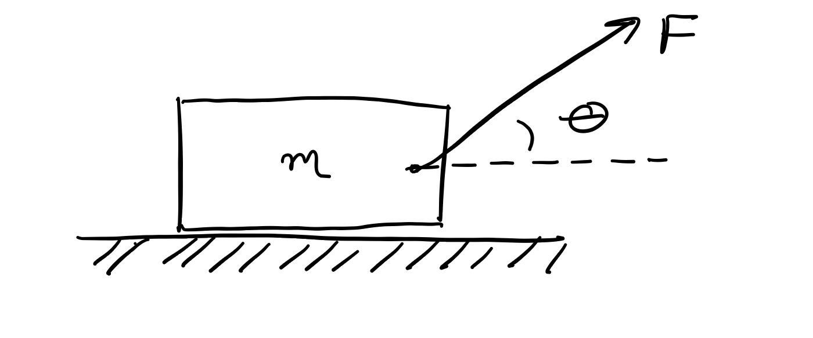

# MECH 105: Homework 11
# False Position Algorithm Development

## Rules / Suggestions
The following rules apply to ALL of our Algorithm Development Problems. These are helpful when you are testing your function and we will grade you on them.

1. You must use the correct function name.
2. Check number of function inputs and outputs (vector and scalar inputs)
3. Clear variables in workspace prior to running tests
4. If variable names are not given, use appropriate and consistent names
5. Check function for all possible number of inputs (use nargin during development to catch errors)
6. Run algorithm for at least 2 different input values
7. Check algorithm does not produce extraneous output
8. Comment code for readability

## False Position Algorithm
Develop a function named `falsePosition.m` which estimates the root of a given funtion. Your function should have the following:

Inputs:

* func - the function being evaluated
* $x_l$ - the lower guess
* $x_u$ - the upper guess
* es - the desired relative error (should default to 0.0001%)
* maxiter - the number of iterations desired (should default to 200)

Outputs:

* root - the estimated root location
* fx - the function evaluated at the root location
* ea - the approximate relative error (%)
* iter - how many iterations were performed

~~Note: you will also need to develop another funciton called `bisect.m`. You CAN copy from Figure 5.7 in your book but don't copy it blindly. If you make that function first, it will likely help you with Part 1 of this assignment.~~

### **FOR TESTING PURPOSES ONLY**
The following is included for testing purposes. DO NOT INCLUDE THIS IN YOUR FUNCTION FILE. Remember, the function should work independently of the problem. This problem just gives you an idea of HOW to use the function you developed.

Consider a box of mass $m = 25kg$ being pulled by a rope. The force required to move is given by:
$${F}={{\mu m g}\over{cos\theta + \mu sin\theta}}$$

Let:
* $\mu = 0.55$
* $g = 9.81 m/s^2$

Create a MATLAB script that solves for $\theta$ if $F = 150N$. Your script should create a plot of a function that is dependent on $\theta$. Use the `falsePosition` function in your script file. Finally, your script should include a pair of `fprintf` statement(s). Each should comment on the value selected as the root, how many iterations the method took, what the approximate error is and what f is evaluated at the root. You need a `fprintf` statement(s) for each function. Finally, when you run each function, use the default values of the function when you can. 

Note: You should change the `format` to `long` early in your script. 
